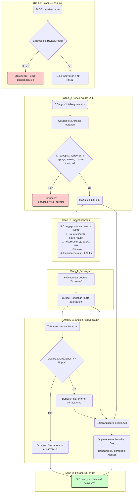

# Задача №8 Сервис для выявления компьютерных томографий органов грудной клетки без патологий

**Screener** — это система искусственного интеллекта для автоматического анализа компьютерной томографии (КТ) органов грудной клетки с целью определения нормы и патологии. Система использует нейронные сети для сегментации анатомических структур и выявления аномалий в медицинских изображениях.

## Основные возможности:
- Автоматическая загрузка и обработка DICOM-файлов из zip-архивов
- Сегментация анатомических структур грудной клетки (легкие, сердце, аорта, трахея, ребра)
- Детекция патологий с локализацией и вероятностной оценкой
- Экспорт результатов в Excel-формат
- Поддержка кэширования и логирования

## 🚀 Быстрый старт

**Развернутый сервер доступен по адресу**: `http://screener.airi.net:3080`

### Для загрузки файлов:

#### Вариант 1: Пакетная загрузка (скрипт)
**Запустите скрипт загрузки** на своей машине:
   ```bash
   python upload.py /path/to/your/zip/files
   ```
3. **Скрипт автоматически**:
   - Найдет все ZIP-файлы в указанной директории
   - Загрузит их на сервер с аутентификацией
   - Покажет прогресс и результаты загрузки

#### Вариант 2: Загрузка через веб-интерфейс (по одному файлу)
1. **Откройте веб-интерфейс**: `http://screener.airi.net:3080`
2. **Войдите в систему** с логином и паролем
3. **Загрузите ZIP-файлы** по одному через интерфейс загрузки
4. **Отслеживайте прогресс** обработки в реальном времени

### Что происходит дальше:
- Сервер автоматически обработает загруженные КТ-исследования
- Результаты анализа будут доступны для выгрузки в формате xls через веб-интерфейс
- Вы получите отчеты о выявленных патологиях

---

## Архитектура

### Структура проекта

```
screener_mos/
├── AiriApp/              # Основной модуль приложения
│   ├── AiriFMApp.py      # Основной класс приложения
│   ├── StudiesClass.py   # Управление базой данных исследований
│   ├── StudyLoader.py    # Загрузчик DICOM-файлов
│   ├── ScreenerModel.py  # Модель ИИ для анализа
│   ├── ProccessStudyClass.py # Обработка исследований
│   ├── Dockerfile        # Контейнер для продакшена (CUDA)
│   ├── Dockerfile.dev    # Контейнер для разработки (CPU)
│   └── __init__.py       # Инициализация модуля
├── Addition/             # Дополнительные модули и зависимости
├── Data/                 # Директория для данных и кэша
├── GuiBackend/           # Backend для веб-интерфейса
├── GuiFrontend/          # Frontend веб-интерфейса (TypeScript/React)
├── upload.py             # Утилита для загрузки файлов на сервер
├── docker-compose.gui.yml # Docker Compose для веб-интерфейса
└── README.md            # Документация
```

### Ключевые компоненты

#### 1. Screener (AiriFMApp.py)
- **Назначение**: Главный класс приложения, координирующий работу всех модулей
- **Функции**:
  - Инициализация конфигурации и логирования
  - Управление циклом обработки исследований
  - Интеграция с моделью ИИ и базой данных

#### 2. StudiesClass (StudiesClass.py)
- **Назначение**: Управление базой данных исследований
- **Функции**:
  - Хранение метаданных исследований в CSV-формате
  - Отслеживание статуса обработки
  - Экспорт результатов в Excel

#### 3. StudyLoader (StudyLoader.py)
- **Назначение**: Загрузка и обработка DICOM-файлов
- **Функции**:
  - Распаковка zip-архивов с DICOM-файлами
  - Чтение метаданных DICOM
  - Конвертация в формат NIfTI для анализа

#### 4. ScreenerModel (ScreenerModel.py)
- **Назначение**: Модель ИИ для анализа КТ-изображений
- **Функции**:
  - Сегментация анатомических структур с помощью TotalSegmentator
  - Детекция аномалий с помощью обученной нейронной сети
  - Генерация карт аномалий и локализация патологий

#### 5. FileUploader (upload.py) - Внешняя утилита
- **Расположение**: Корень проекта (вне модуля AiriApp)
- **Назначение**: Утилита для загрузки ZIP-файлов с исследованиями на сервер
- **Функции**:
  - Поиск всех ZIP-файлов в указанной директории
  - Загрузка файлов на API-сервер с аутентификацией
  - Пакетная обработка множественных файлов
  - Отчетность о результатах загрузки

### Примечания:
**requests** - библиотека для выполнения HTTP-запросов, необходима для работы скрипта `upload.py`. 

**Установка:**
```bash
pip install requests
```

#### 6. GuiBackend - Backend веб-интерфейса
- **Расположение**: Отдельная папка в корне проекта
- **Назначение**: REST API сервер для веб-интерфейса
- **Функции**:
  - HTTP API для взаимодействия с основным приложением
  - Обработка запросов от фронтенда
  - Управление сессиями и аутентификацией

#### 7. GuiFrontend - Frontend веб-интерфейса
- **Расположение**: Отдельная папка в корне проекта
- **Технологии**: TypeScript, React
- **Назначение**: Веб-интерфейс для взаимодействия с системой
- **Функции**:
  - Пользовательский интерфейс для загрузки файлов
  - Просмотр результатов анализа
  - Управление настройками системы

#### 8. Addition - Дополнительные модули
- **Расположение**: Отдельная папка в корне проекта
- **Назначение**: Дополнительные зависимости и модули
- **Содержимое**: Включает medimm-main и screener-main пакеты

### Схема процесса обработки



## Зависимости

### Python-библиотеки:

```python
# Основные зависимости
pandas==2.3.3                   # Работа с данными
numpy==2.2.6                    # Численные вычисления
simpleitk==2.5.2                # Обработка медицинских изображений
nibabel==5.3.2                  # Работа с NIfTI файлами
scikit-image==0.25.0            # Обработка изображений
TotalSegmentator==2.11.0        # Сегментация анатомических структур
openpyxl==3.1.5                 # Работа с Excel файлами

# Веб-интерфейс (Backend)
uvicorn==0.37.0                 # ASGI сервер
fastapi==0.118.0                # Веб-фреймворк
pydantic==2.11.9                # Валидация данных
python-jose==3.5.0              # JWT токены
bcrypt==4.0.1                   # Хеширование паролей
passlib[bcrypt]                 # Управление паролями
aiofiles==24.1.0                # Асинхронная работа с файлами
python-multipart                # Обработка multipart данных

# Дополнительные зависимости (устанавливаются отдельно)
torch>=2.0.0                    # PyTorch для нейронных сетей
torchvision>=0.15.0             # Дополнительные функции PyTorch
scipy>=1.7.0                    # Научные вычисления
```

### Системные зависимости:
- **CUDA 12.6** (для GPU-ускорения)
- **Ubuntu 22.04** (базовая ОС)
- **Python 3.10+**

## Инструкция по установке и запуску

### 1. Установка с Docker (рекомендуется)

#### Продакшен-версия (с GPU):
```bash
# Сборка образа
docker build -f Dockerfile -t airi-app:latest .

# Запуск контейнера
docker run --gpus all -v /path/to/data:/app/Data -v /path/to/config:/app/config.json airi-app:latest
```

#### Версия для разработки (CPU):
```bash
# Сборка образа
docker build -f Dockerfile.dev -t airi-app:dev .

# Запуск контейнера
docker run -v /path/to/data:/app/Data -v /path/to/config:/app/config.json airi-app:dev
```

### 2. Установка без Docker

```bash
# Клонирование репозитория
git clone <repository-url>
cd AiriApp

# Создание виртуального окружения
python -m venv venv
source venv/bin/activate  # Linux/Mac
# или
venv\Scripts\activate     # Windows

# Установка зависимостей
pip install -r requirements.txt

# Установка дополнительных пакетов
pip install torch torchvision --index-url https://download.pytorch.org/whl/cu126  # для GPU
# или
pip install torch torchvision --index-url https://download.pytorch.org/whl/cpu   # для CPU
```

### 3. Конфигурация

#### Скачивание весов модели:
1. **Скачайте веса модели** по ссылке: [https://disk.yandex.ru/d/7E-LoW0qb92p5Q](https://disk.yandex.ru/d/7E-LoW0qb92p5Q)
2. **Пароль для архива** - уточните у команды
3. **Распакуйте файл** `glow_model.pt` в папку `./Data/Weights/`

#### Создание конфигурации:
Создайте файл `config.json` в корне проекта:

```json
{
    "DataPath": "./Data/data",
    "OutputPath": "./Data/output", 
    "CacheDir": "./Data/cache",
    "checkpoint": "./Data/Weights/glow_model.pt"
}
```

### 4. Запуск приложения

#### Консольный режим:
```python
from AiriApp import AiriFMApp
import asyncio

# Создание экземпляра приложения
app = AiriFMApp(saveMask=True)

# Запуск основного цикла
asyncio.run(app.Run())
```

#### Веб-интерфейс (рекомендуется):
```bash
# Сборка и запуск с веб-интерфейсом
docker-compose -f docker-compose.gui.yml build
docker-compose -f docker-compose.gui.yml up

# Все папки примонтируются, можно вносить изменения
```

Веб-интерфейс предоставляет удобный способ взаимодействия с системой через браузер.

**Важно**: Для корректной работы визуализации обработанных КТ-изображений рекомендуется использовать браузер Firefox версии 142.0.1. Остальной функционал (загрузка файлов и обработка данных) доступен во всех современных браузерах.

## API / CLI

### Основные методы AiriFMApp:

```python
# Создание приложения
app = AiriFMApp(saveMask=True)

# Запуск обработки
await app.Run()

# Остановка приложения
app.Release()

# Доступ к исследованиям
studies = app.Studies

# Получение конфигурации
config = app.Config
```

### Методы StudiesClass:

```python
# Добавление нового исследования
await studies.AddData(study_id, isReturn=False)

# Проверка наличия новых исследований
study_id = await studies.HasNew()

# Получение данных исследования
study_data = await studies.GetData(study_id)

# Обновление данных исследования
studies.UpdateData(study_id, data)

# Экспорт результатов
studies.Export()
```

### FileUploader CLI:

```bash
# Загрузка всех ZIP-файлов из директории (из корня проекта)
python upload.py /path/to/zip/files

# Пример использования
python upload.py ./Data/studies/
```

### Методы FileUploader:

```python
# Импорт из корня проекта
from upload import FileUploader

# Создание загрузчика
uploader = FileUploader("http://screener.airi.net:7534/v1/upload", "MOSCOWTOCKEN2025")

# Поиск ZIP-файлов
zip_files = uploader.find_zip_files("/path/to/directory")

# Загрузка одного файла
result = uploader.upload_file("/path/to/file.zip")

# Загрузка всех файлов из директории
uploader.upload_all_files("/path/to/directory")
```

## Примеры использования

### Базовый пример запуска:

```python
import asyncio
import os
from AiriApp import AiriFMApp

# Установка переменной окружения для конфигурации
os.environ['CONFIG'] = './config.json'

async def main():
    # Создание приложения
    app = AiriFMApp(saveMask=True)
    
    try:
        # Запуск обработки
        await app.Run()
    except KeyboardInterrupt:
        print("Остановка приложения...")
    finally:
        # Освобождение ресурсов
        app.Release()

if __name__ == "__main__":
    asyncio.run(main())
```

### Обработка конкретного исследования:

```python
from AiriApp import AiriFMApp, StudyLoader
import asyncio

async def process_single_study(study_path):
    app = AiriFMApp()
    
    # Загрузка исследования
    loader = StudyLoader(study_path)
    
    for series_data in loader:
        if series_data['metadata']['Modality'] == 'CT':
            # Конвертация в NIfTI
            nii = StudyLoader.MakeNII(series_data)
            
            # Анализ моделью
            result = app._model.predict(
                nii=nii,
                study_id=series_data['metadata']['StudyInstanceUID'],
                series_id=series_data['metadata']['SeriesInstanceUID']
            )
            
            print(f"Результат анализа: {result[0]}")

# Запуск
asyncio.run(process_single_study("/path/to/study.zip"))
```

### Запуск с веб-интерфейсом:

```bash
# Клонирование репозитория
git clone https://github.com/drnechaev/screener_mos.git
cd screener_mos

# Запуск с веб-интерфейсом
docker-compose -f docker-compose.gui.yml build
docker-compose -f docker-compose.gui.yml up

# Веб-интерфейс будет доступен по адресу:
# http://localhost:3080 - Frontend
# http://localhost:7534 - Backend API
```

### Загрузка файлов на сервер:

```python
from upload import FileUploader

# Создание загрузчика с настройками API
uploader = FileUploader(
    api_url="http://screener.airi.net:7534/v1/upload",
    token="MOSCOWTOCKEN2025"
)

# Загрузка всех ZIP-файлов из директории
uploader.upload_all_files("./Data/studies/")

# Результат будет выведен в консоль:
# Found 5 files
# Uploading: study1.zip
# ✓ Success: study1.zip
# ------------------------------
# Uploading: study2.zip
# ✓ Success: study2.zip
# ------------------------------
# Completed: 5/5 successful
```

## Разработка и тестирование

### Структура данных

Приложение ожидает следующие структуры данных:

1. **Входные данные**: ZIP-архивы с DICOM-файлами КТ-исследований
2. **Выходные данные**: Excel-файл с результатами анализа

### Логирование

Система использует ротационное логирование:
- Логи сохраняются в `./Data/logs/logfile.log`
- Максимальный размер файла: 10MB
- Количество резервных копий: 100

### Кэширование

- Кэш сохраняется в директории, указанной в `CacheDir`
- Поддерживается кэширование сегментаций и промежуточных результатов

### Мониторинг

Приложение выводит информацию о:
- Статусе обработки исследований
- Времени выполнения анализа
- Ошибках и предупреждениях

## Ограничения и требования

### Системные требования:
- **GPU**: NVIDIA GPU с поддержкой CUDA 12.6 (рекомендуется)
- **RAM**: Минимум 8GB, рекомендуется 16GB+
- **Дисковое пространство**: 10GB+ для моделей и кэша

### Поддерживаемые форматы:
- **Входные данные**: DICOM-файлы в ZIP-архивах
- **Модальности**: CT (компьютерная томография)
- **Выходные данные**: Excel (.xlsx), NIfTI (.nii)

### Ограничения:
- Обрабатываются только КТ-исследования органов грудной клетки
- Требуется наличие всех необходимых анатомических структур
- Минимальный размер изображения: 96×96×96 пикселей

## Поддержка

Техническая поддержка осуществляется через Telegram по контактам:
- **@MitiaU** - основная поддержка и вопросы по использованию
- **@godlikegt** - технические вопросы и баг-репорты

