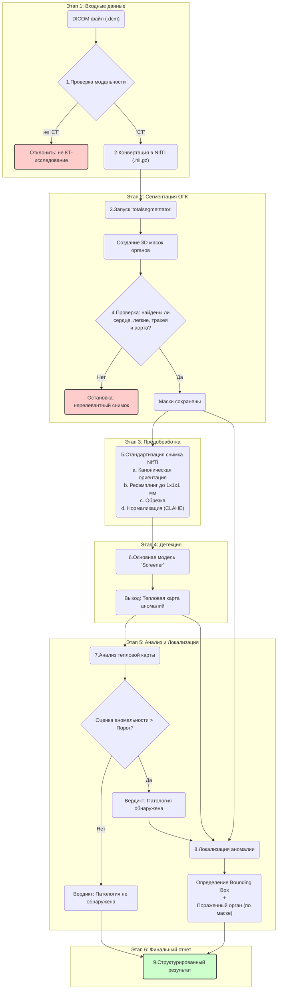

# Задача №8 Сервис для выявления компьютерных томографий органов грудной клетки без патологий

**Screener** — это система искусственного интеллекта для автоматического анализа компьютерной томографии (КТ) органов грудной клетки с целью определения нормы и патологии. Система использует нейронные сети для сегментации анатомических структур и выявления аномалий в медицинских изображениях.

## Основные возможности:
- Автоматическая загрузка и обработка DICOM-файлов из zip-архивов
- Сегментация анатомических структур грудной клетки (легкие, сердце, аорта, трахея, ребра)
- Детекция патологий с локализацией и вероятностной оценкой
- Экспорт результатов в Excel-формат
- Поддержка кэширования и логирования

## Архитектура

### Структура проекта

```
AiriApp/
├── AiriFMApp.py          # Основной класс приложения
├── StudiesClass.py       # Управление базой данных исследований
├── StudyLoader.py        # Загрузчик DICOM-файлов
├── ScreenerModel.py      # Модель ИИ для анализа
├── ProccessStudyClass.py # Обработка исследований
├── __init__.py           # Инициализация модуля
├── Dockerfile            # Контейнер для продакшена (CUDA)
├── Dockerfile.dev        # Контейнер для разработки (CPU)
└── README.md             # Документация
```

### Ключевые компоненты

#### 1. Screener (AiriFMApp.py)
- **Назначение**: Главный класс приложения, координирующий работу всех модулей
- **Функции**:
  - Инициализация конфигурации и логирования
  - Управление циклом обработки исследований
  - Интеграция с моделью ИИ и базой данных

#### 2. StudiesClass (StudiesClass.py)
- **Назначение**: Управление базой данных исследований
- **Функции**:
  - Хранение метаданных исследований в CSV-формате
  - Отслеживание статуса обработки
  - Экспорт результатов в Excel

#### 3. StudyLoader (StudyLoader.py)
- **Назначение**: Загрузка и обработка DICOM-файлов
- **Функции**:
  - Распаковка zip-архивов с DICOM-файлами
  - Чтение метаданных DICOM
  - Конвертация в формат NIfTI для анализа

#### 4. ScreenerModel (ScreenerModel.py)
- **Назначение**: Модель ИИ для анализа КТ-изображений
- **Функции**:
  - Сегментация анатомических структур с помощью TotalSegmentator
  - Детекция аномалий с помощью обученной нейронной сети
  - Генерация карт аномалий и локализация патологий

### Схема процесса обработки



## Зависимости

### Python-библиотеки (не было реквайментов - поставила из головы):

```python
# Основные зависимости
torch>=2.0.0                    # PyTorch для нейронных сетей
torchvision>=0.15.0             # Дополнительные функции PyTorch
numpy>=1.21.0                   # Численные вычисления
pandas>=1.3.0                   # Работа с данными
nibabel>=4.0.0                  # Работа с NIfTI файлами
SimpleITK>=2.2.0                # Обработка медицинских изображений
scipy>=1.7.0                    # Научные вычисления
scikit-image>=0.19.0            # Обработка изображений
totalsegmentator>=1.5.0         # Сегментация анатомических структур
```

### Системные зависимости:
- **CUDA 12.6** (для GPU-ускорения)
- **Ubuntu 22.04** (базовая ОС)
- **Python 3.10+**

## Инструкция по установке и запуску

### 1. Установка с Docker (рекомендуется)

#### Продакшен-версия (с GPU):
```bash
# Сборка образа
docker build -f Dockerfile -t airi-app:latest .

# Запуск контейнера
docker run --gpus all -v /path/to/data:/app/Data -v /path/to/config:/app/config.json airi-app:latest
```

#### Версия для разработки (CPU):
```bash
# Сборка образа
docker build -f Dockerfile.dev -t airi-app:dev .

# Запуск контейнера
docker run -v /path/to/data:/app/Data -v /path/to/config:/app/config.json airi-app:dev
```

### 2. Установка без Docker

```bash
# Клонирование репозитория
git clone <repository-url>
cd AiriApp

# Создание виртуального окружения
python -m venv venv
source venv/bin/activate  # Linux/Mac
# или
venv\Scripts\activate     # Windows

# Установка зависимостей - СЕЙЧАС ИХ НЕТ В ПРОЕКТЕ
pip install -r requirements.txt

# Установка дополнительных пакетов
pip install torch torchvision --index-url https://download.pytorch.org/whl/cu126  # для GPU
# или
pip install torch torchvision --index-url https://download.pytorch.org/whl/cpu   # для CPU
```

### 3. Конфигурация

Создайте файл `config.json` в корне проекта:

```json
{
    "DataPath": "./Data/data",
    "OutputPath": "./Data/output", 
    "CacheDir": "./Data/cache",
    "checkpoint": "./Data/Weights/glow_model.pt"
}
```

### 4. Запуск приложения

```python
from AiriApp import AiriFMApp
import asyncio

# Создание экземпляра приложения
app = AiriFMApp(saveMask=True)

# Запуск основного цикла
asyncio.run(app.Run())
```

## API / CLI

### Основные методы AiriFMApp:

```python
# Создание приложения
app = AiriFMApp(saveMask=True)

# Запуск обработки
await app.Run()

# Остановка приложения
app.Release()

# Доступ к исследованиям
studies = app.Studies

# Получение конфигурации
config = app.Config
```

### Методы StudiesClass:

```python
# Добавление нового исследования
await studies.AddData(study_id, isReturn=False)

# Проверка наличия новых исследований
study_id = await studies.HasNew()

# Получение данных исследования
study_data = await studies.GetData(study_id)

# Обновление данных исследования
studies.UpdateData(study_id, data)

# Экспорт результатов
studies.Export()
```

## Примеры использования

### Базовый пример запуска:

```python
import asyncio
import os
from AiriApp import AiriFMApp

# Установка переменной окружения для конфигурации
os.environ['CONFIG'] = './config.json'

async def main():
    # Создание приложения
    app = AiriFMApp(saveMask=True)
    
    try:
        # Запуск обработки
        await app.Run()
    except KeyboardInterrupt:
        print("Остановка приложения...")
    finally:
        # Освобождение ресурсов
        app.Release()

if __name__ == "__main__":
    asyncio.run(main())
```

### Запуск из докера приложения с веб данными

```bash
docker-compose -f docker-compose.gui.yml build
docker-compose -f docker-compose.gui.yml up
```
Все папки примонтируются, можно вносить изменения


### Обработка конкретного исследования:

```python
from AiriApp import AiriFMApp, StudyLoader
import asyncio

async def process_single_study(study_path):
    app = AiriFMApp()
    
    # Загрузка исследования
    loader = StudyLoader(study_path)
    
    for series_data in loader:
        if series_data['metadata']['Modality'] == 'CT':
            # Конвертация в NIfTI
            nii = StudyLoader.MakeNII(series_data)
            
            # Анализ моделью
            result = app._model.predict(
                nii=nii,
                study_id=series_data['metadata']['StudyInstanceUID'],
                series_id=series_data['metadata']['SeriesInstanceUID']
            )
            
            print(f"Результат анализа: {result[0]}")

# Запуск
asyncio.run(process_single_study("/path/to/study.zip"))
```

## Разработка и тестирование

### Структура данных

Приложение ожидает следующие структуры данных:

1. **Входные данные**: ZIP-архивы с DICOM-файлами КТ-исследований
2. **Выходные данные**: Excel-файл с результатами анализа

### Логирование

Система использует ротационное логирование:
- Логи сохраняются в `./Data/logs/logfile.log`
- Максимальный размер файла: 10MB
- Количество резервных копий: 100

### Мониторинг

Приложение выводит информацию о:
- Статусе обработки исследований
- Времени выполнения анализа
- Ошибках и предупреждениях

## Ограничения и требования

### Системные требования:
- **GPU**: NVIDIA GPU с поддержкой CUDA 12.6 (рекомендуется)
- **RAM**: Минимум 8GB, рекомендуется 16GB+
- **Дисковое пространство**: 10GB+ для моделей и кэша

### Поддерживаемые форматы:
- **Входные данные**: DICOM-файлы в ZIP-архивах
- **Модальности**: CT (компьютерная томография)
- **Выходные данные**: Excel (.xlsx), NIfTI (.nii)

### Ограничения:
- Обрабатываются только КТ-исследования органов грудной клетки
- Требуется наличие всех необходимых анатомических структур
- Минимальный размер изображения: 96×96×96 пикселей

## Лицензия

*Какую указываем???*

## Поддержка

*Куда им обращаться?*

---


